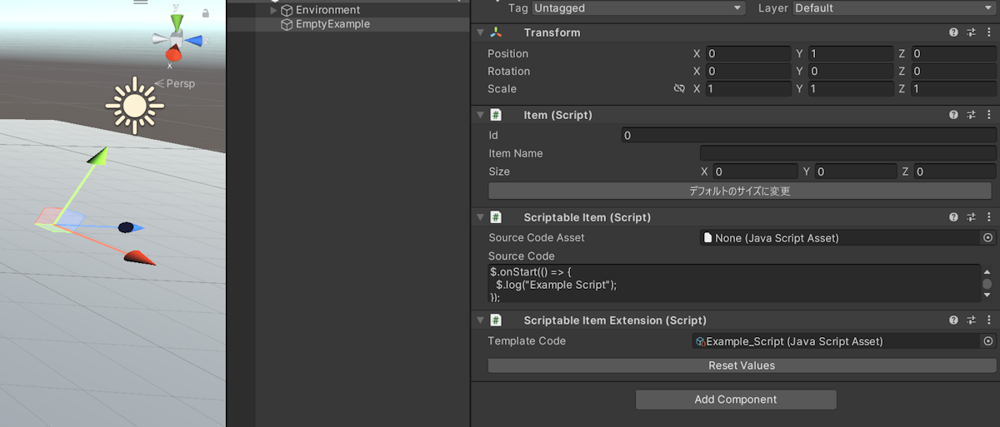
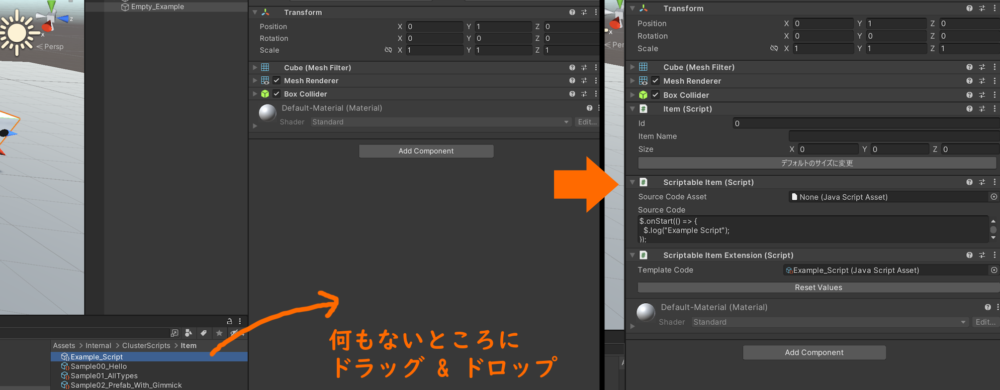
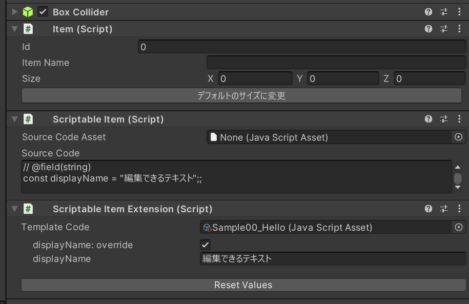
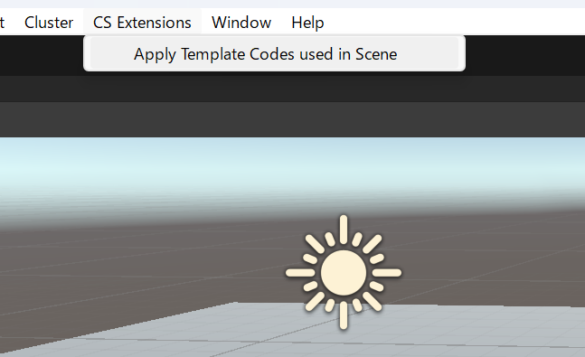

# ClusterScript Extensions

Author: 獏星(ばくすたー) / Baxter [X (Twitter)](https://x.com/baku_dreameater)

ClusterScript Extensions (CS Extensions) は [Cluster Script](https://docs.cluster.mu/script/) の編集/カスタム機能を拡張するプロジェクトです。

MonoBehaviour で記述したスクリプトに近い編集体験を目指して開発しています。

## Features

- MonoBehaviourの `[SerializeField]` のような、インスペクターで編集できるフィールドを Cluster Script に定義できます。
- 現時点では簡単なデータ型 (`bool`や`string`など) にしか対応していませんが、拡張を計画しています。


## CS Extensions の利用が適する場面

CS Extensions は以下のケースでの利用に適しています。

- 同一のスクリプトを、一部のパラメータだけ書き換えて再利用したい
- 一部の値だけカスタムする想定のスクリプトを配布したいが、その際にユーザーがスクリプトを書き換えないで済むようにしたい
  - ※この場合、配布先のユーザーもCS Extensionを導入する必要があります。


いっぽう、以下のケースでは CS Extensions の利用は必ずしも適していません。下記に当てはまる場合、通常の `Scriptable Item` や `Player Script` を併用します。

- 再利用やカスタムを前提とせず、1箇所でのみ使うような Cluster Script を作成している
- スクリプトが `Player Script` 用のものである
  - ※対応予定はありますが未対応です


## Prerequisites

CS Extensions と連動するスクリプトを作成するには [Cluster Script](https://docs.cluster.mu/script/) の知識が必要になります。


## Install

使用中のプロジェクトに [Cluster Creator Kit](https://docs.cluster.mu/creatorkit/) の v2.20.0 またはそれ以降が導入されていることを確認します。

その後、 [Releases](https://github.com/malaybaku/ClusterScriptExtensions/releases) に含まれる `.unitypackage` ファイルをダウンロードし、プロジェクトに導入します。


※UPMによる配布も計画していますが、コードの安定性やDLLの同梱方式を検討中のため未対応です。


## How to Use

### `Scriptable Item Extension` コンポーネントのセットアップ

CS Extensions の機能を使うには、 `Item` を含むオブジェクトに `Scriptable Item Extension` コンポーネントをアタッチします。

`Scriptable Item Extension` コンポーネントをアタッチすると、 `Scriptable Item` も同時にアタッチされ、かつ `Scriptable Item` の内容は自動で更新されるようになります。
そのため、 `Scriptable Item` は直接編集しないようにします。 `Source Code Asset` も未指定のままにしておきます。

その後、 `Scriptable Item Extension` の `Template Code` にスクリプトを指定することで基本的なセットアップは完了します。



なお、同一のワールド上で `Scriptable Item Extension` を使用するゲームオブジェクトと、`Scriptable Item` のみを使用するゲームオブジェクトが混在しても問題ありません。

### 簡略化したセットアップ手順

前述した一連のセットアップ操作を行う代わりに、プロジェクトビューから GameObject のインスペクターに直接 `.js` 拡張子を持つファイルをドラッグ & ドロップする方法でも、 `Scriptable Item Extension` コンポーネントをセットアップできます。




### カスタム可能なフィールドを定義して編集する

`Template Code` に指定したスクリプト内で `// @field` から始まる特殊なコメントを記述することで、その次の行に定義した変数を Unity Editor のインスペクターから編集できます。

編集可能にしたいフィールドは `const` として定義しておきます。

```javascript
// @field(string)
const displayName = "example";

$.onStart(() => {
  $.log(`Hello, ${myValue}!`);
});
```

上記のスクリプトを `Template Code` に指定すると、インスペクター上で以下のように表示されます。



プロパティの `override` にチェックを入れてから値を編集すると、値を上書きした結果が `Scriptable Item` に適用されます。上記の例では `displayName` を実際に上書きしています。


現時点では下記のような記法で、7種類のデータ型をサポートしています。

```
// @field(bool)
const myBool = false;

// @field(int)
const myInt = 1;

// @field(float)
const myFloat = 1.23;

// @field(string)
const myString = "Test";

// @field(Vector2)
const myVector2 = new Vector2(1, 2);

// @field(Vector3)
const myVector3 = new Vector3(3, 4, 5);

// @field(Quaternion)
const myQuaternion = new Quaternion();
```

`Quaternion` 以外では、初期値を直接的な値として記載してあればインスペクター上でも初期値として反映されます。

`const myInt = 1 + 2;` など、値のリテラルではない式で初期値を指定した場合、初期値は`0`や空文字(`""`)など、デフォルト値であるものとして扱われます。

また、上記の `// @field` から始まるコメントは関数内に記述すると動作しません。
例えば、 `$.onStart()` の内側で上記のコメントを記述しても無視されます。


### Template Codeのスクリプトを改変したときの操作

`Template Code` に指定したスクリプトを書き換えたものの、フィールド値の再編集は行いたくない場合、ワールドのアップロード前にスクリプトの更新を適用する必要があります。

メニューバーで `CS Extensions` > `Apply Template Codes used in Scene` を選択すると、現在開いているシーン上で使用している `Scriptable Item Extension` を一括でチェックし、必要に応じてスクリプトの内容が適用されます。



この更新操作では下記のオブジェクトが更新対象となります。

- シーン上のオブジェクト
- シーン上に存在する [Create Item Gimmick](https://docs.cluster.mu/creatorkit/gimmick-components/create-item-gimmick/) コンポーネントで参照しているprefab
- シーン上に存在する [World Item Template List](https://docs.cluster.mu/creatorkit/item-components/world-item-template-list/) で参照しているprefab


## 内部挙動とデバッグについて

`Scriptable Item Extension` は内部的には下記の処理を行っており、エディタ上で動作が完結します。

- `Template Code` のスクリプトを構文解析し、編集対象とするフィールドを検出してインスペクターに表示します。
- `Template Code` の構文解析の結果、およびインスペクターで指定した値を組み合わせることでスクリプトのテキストを新規に生成し、 `Scriptable Item` のスクリプトとして適用します。

アプリケーションの実行時には `Scriptable Item Extension` コンポーネントは何も行いません。

必要な場合、`Scriptable Item` に適用されたテキスト全体をコピーしてテキストエディタにペーストするなどの方法により、CS Extensionsが期待通りに動作しているかどうかを確認できます。


## License

レポジトリ上でソースコードとして含まれるコードのライセンスは [LICENSE](./LICENSE) に基づきます。

## Third Party

本プロジェクトに含まれる `Esprima.dll` は [esprima-dotnet](https://github.com/sebastienros/esprima-dotnet) の配布バイナリであり、構文解析に使用しています。

ライセンスは [LICENSE.txt](./Assets/Source/Editor/DLLs/LICENSE.txt) を参照して下さい。
