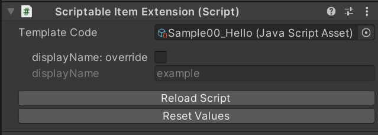
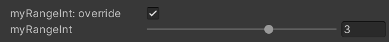
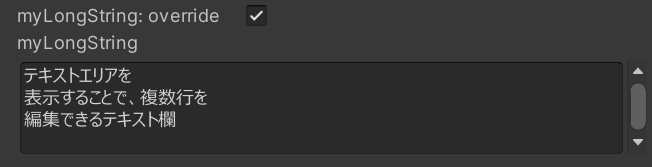
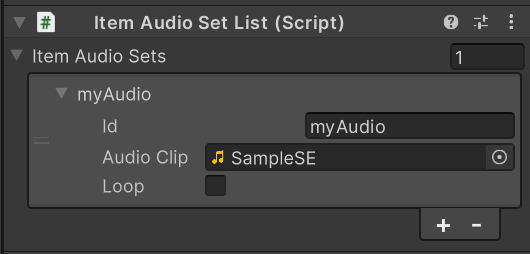
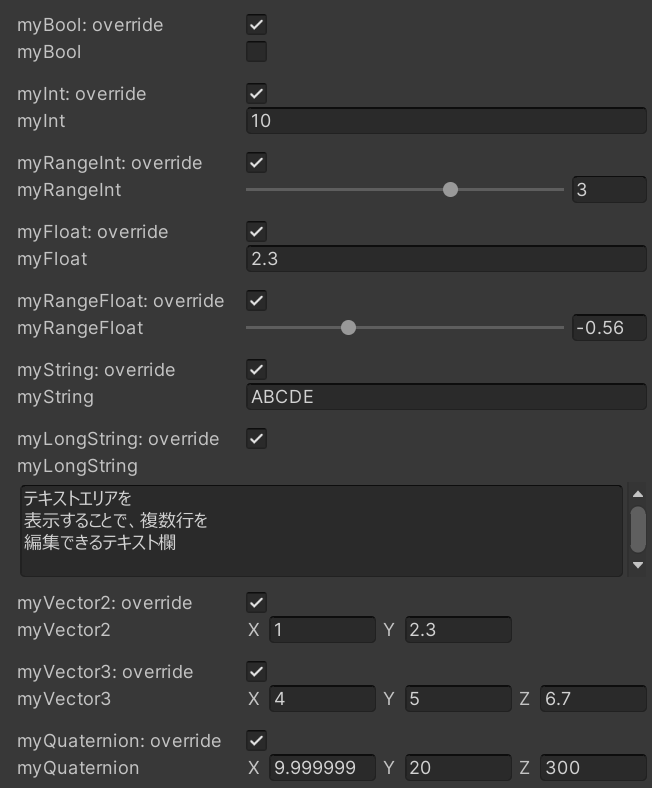
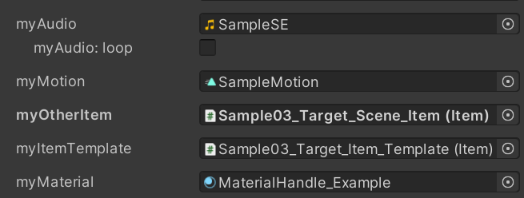

# CS Extensions Script Examples

このページでは、 CS Extensions で記述できるスクリプトの具体例を紹介します。

CS Extensions を用いたスクリプトを書くためのコンポーネントのセットアップについては [README#How to Use](https://github.com/malaybaku/ClusterScriptExtensions#how-to-use)を参照してください。

また、個別のAPIについては詳解しないため、公式リファレンスである [Script Reference](https://docs.cluster.mu/script/) を参照してください。

## `// @field()` コメントによるインスペクターへの表示

`Scriptable Item Extension` コンポーネントの `Template Code` に指定したスクリプト上で、 `// @field` から始まる特殊なコメントを記述することで、その次の行に定義した値を Unity Editor のインスペクターから編集できます。

編集可能にしたいフィールドは `const` として定義しておきます。

```javascript
// @field(string)
const displayName = "example";

$.onStart(() => {
  $.log(`Hello, ${displayName}!`);
});
```

上記のスクリプトを `Template Code` に指定した場合、インスペクター上で以下のように表示され、編集が可能になります。



上記の `// @field` から始まるコメントは関数内に記述すると動作しません。
例えば、 `$.onStart()` の内側で上記のコメントを記述しても無視されます。


## 基本的なデータ型

文字列や数値など、定数として記述できるデータ型としては `bool`, `int`, `float`, `string`, `Vector2`, `Vector3`, `Quaternion` の7種類を使用できます。

```
// @field(bool)
const myBool = false;

// @field(int)
const myInt = 1;

// @field(float)
const myFloat = 1.23;

// @field(string)
const myString = "Test";

// @field(Vector2)
const myVector2 = new Vector2(1, 2);

// @field(Vector3)
const myVector3 = new Vector3(3, 4, 5);

// @field(Quaternion)
const myQuaternion = new Quaternion();
```

`Quaternion` 以外では、初期値を直接的な値として記載してあればインスペクター上でも初期値として反映されます。`const myInt = 1 + 2;` など、値のリテラルではなく式で初期値を指定した場合、初期値は`0`や空文字(`""`)などのデフォルト値であるものとして扱われます。

プリミティブのデータ型では、インスペクター上でプロパティ値とともに `override` チェックボックスが表示されます。編集時はこのチェックを入れてから値を編集すると、上書きした値が `Scriptable Item` に適用されます。`override` をチェックをしない場合、 CS Extensions が初期値として判定した値が適用されます。

`int`, `float` では `@range()` を追加で定義すると最小値と最大値を指定でき、インスペクターではスライダーで編集できるプロパティを表示します。

```
// @field(int), @range(-10, 20)
const myInt = 1;
```



`string` では通常は1行のテキストを表示して編集しますが、 `@textArea` を追加で指定すると、複数行テキストをカスタムするインスペクターを表示します。

```
// @field(string), @textArea
const myLongText = "";
```




## アセットを参照するデータ型

音声ファイルや他のItemなど、アセットやオブジェクトを参照するデータ型としては下記の5種類をサポートしています。

```
// @field(AudioClip)
const myAudio = $.audio("");

// @field(HumanoidAnimation)
const myMotion = $.humanoidAnimation("");

// @field(WorldItem)
const myOtherItem = $.worldItemReference("");

// @field(WorldItemTemplate)
const myItemTemplate = new WorldItemTemplateId("");

// @field(Material)
const myMaterial = $.material("");
```

いずれのデータ型でも、デフォルトではアセットは未指定の状態です。

アセット参照のデータ型については、下記の点について注意して使用してください。

- ソースコードの `""` の部分に有効なid文字列を指定しても CS Extensions は動作しますが、idは CS Extensions の使用中は無視され、自動で新しいidが割り当てられます。
- 「マテリアルは Itemかその子孫要素で使っているマテリアルのみが指定できる」など、データ型ごとに特有の制限事項があります。 CS Extensionsは一部の代表的なケースのエラー表示には対応していますが、Creator Kitの仕様上エラー扱いされるケースの網羅的な検出は行っていません。
- 一部のアセットはベータ機能APIが有効な場合にのみ使用できます。


以下は内部挙動についての補足です。アセット参照のデータ型ではフィールド名をそのままidとして使用し、アセットを参照するコンポーネントを自動で構築します。

例えば、`myAudio` というフィールド名のAudioClipデータに対して `SampleSE` というデータを割り当てた場合、生成されるスクリプトは次のようになります。

```
// @field(AudioClip)
const myAudio = $.audio("myAudio");
```

このスクリプトを生成しつつ、下記の内訳を持つ `ItemAudioSetList` コンポーネントを自動で生成し、アイテムにアタッチします。




## Cheat Sheet: サポートしている記法の一覧

### プリミティブデータのカスタム

| フィールド定義例 | データ型 |
|:---|:---|
| `// @field(bool)` <br> `const myBool = false;`                    | `bool`       |
| `// @field(int)` <br> `const myInt = 0;`                          | `int`        |
| `// @field(int), @range(-10, 10)` <br> `const myRangeInt = 0;`    | `int`        |
| `// @field(float)` <br> `const myFloat = 0.0;`                    | `float`      |
| `// @field(float), @range(-1.5, 1.5)` <br> `const myRangeFloat = 0;`   | `int`   |
| `// @field(string)` <br> `const myString = "";`                    | `string`    |
| `// @field(string), @textArea` <br> `const myLongString = "";`         | `string`|
| `// @field(Vector2)` <br> `const myVector2 = new Vector2(0, 0);`    | `Vector2`  |
| `// @field(Vector3)` <br> `const myVector3 = new Vector3(0, 0, 0);` | `Vector3`  |
| `// @field(Quaternion)` <br> `const myQuaternion = new Quaternion();`  | `Quaternion` |

上記の例に対するインスペクター表示例



### アセット参照のカスタム

| コメント記法 | データ型 | インスペクター表示 | 関連コンポーネント |
|:---|:---|:---|:---|
| `// @field(AudioClip)` <br> `const myField = $.audio("");` | `AudioClip` | | [ItemAudioSetList](https://docs.cluster.mu/creatorkit/item-components/item-audio-set-list/)
| `// @field(HumanoidAnimation)` <br> `const myField = $.humanoidAnimation("");` | `AnimationClip` | | [HumanoidAnimationList](https://docs.cluster.mu/creatorkit/item-components/humanoid-animation-list/)
| `// @field(WorldItem)` <br> `const myField = $.worldItemReference("");` | `Item` | | [WorldItemReferenceList](https://docs.cluster.mu/creatorkit/item-components/world-item-reference-list/)
| `// @field(WorldItemTemplate)` <br> `const myField = new WorldItemTemplateId("");` | `Item` | | [WorldItemTemplateList](https://docs.cluster.mu/creatorkit/item-components/world-item-template-list/)
| `// @field(Material)` <br> `const myField = $.material("");` | `Material` | | [ItemMaterialSetList](https://docs.cluster.mu/creatorkit/item-components/item-material-set-list/)

上記の例に対するインスペクター表示例


